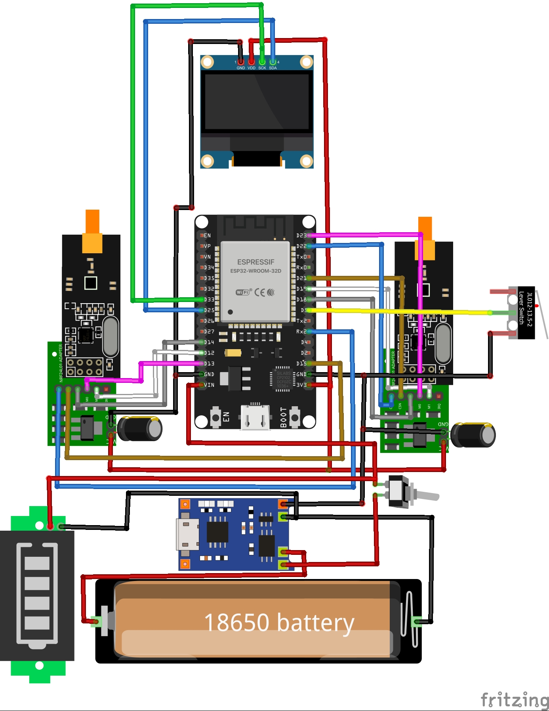

<h1 align="center">Esp32 2.4Ghz jammer</h1>

  
  <h3 align="center">!!Jammer kulanımı YASADIŞIDIR!Sadece eğitim amaçlıdır!</h3>

## ESP32-BlueJammer
Esp32 2.4Ghz Jammer parazit sinyal üreterek kablosuz cihazların sinyallerinin önüne geçer ve bağlantıyı keser 2.4Ghz bandındaki bütün kablosuz cihazlar ve ağlar bu parazit sinyalden etkilenir örneğin (bluetooth hapörlörün sesinin kesilmesi , wifi ağının bağlantısının kesilmesi , rc oyuncakların kumandasının devre dışı kalması ,Iot cihazların internete bağlanmaması,) Esp32 2.4Ghz jammer ın mesafesi donanımınıza göre değişiklik göstermektedir.

**Malzemeler:**  
- **ESP32S WiFi + Bluetooth Dual-Mode Geliştirme Kartı (30 Pin) - Gerekli pinler olduğu sürece diğer ESP32 modelleri de kullanılabilir.**
- **nRF24L01+PA+LNA (Antenli) - Mesafe performansı için antenli modül tercih edilmelidir (2 adet).**
- **10μF Kondansatör - ESP32'den 5V çıkış kullanılacağı için 5V üzeri (10V veya 16V) kondansatör uygundur (2 adet).**
- **0.96 inç I2C OLED Ekran (SSD1306)**
- **IC162 Mini Mikroswitch (3 Pin) - Jammer mod geçişi için.**
- **Toggle Switch - Açma/kapama için.**
- **TP4056 18650 Lityum Pil Şarj Modülü**
- **1S 18650 Lityum Pil Yatağı**
- **1S 18650 Pil Kapasite Göstergesi**
- **2.4GHz Anten (2 adet)** 
- **5x10 cm Delikli Pertinaks (2 adet)** 
- **Lehimleme Ekipmanları - Lehim makinesi, lehim teli, lehim pastası, tek damarlı kablo.**
- **8 Pin nRF24L01 Wireless Modül Adaptörü - İsteğe bağlı kullanılabilir. Modüllerin yanlış bağlantı veya voltajdan zarar görmemesi için adaptör kullanımı önerilir.**

---

## Antenler
nRF24L01+PA+LNA modüllerinin mesafe performansı için harici antenli versiyonlarının kullanılması şarttır. Antensiz (PCB antenli) modüllerin menzili, engelsiz ortamda dahi 10 metreyi geçmekte zorlanır ve bu modüller jammer gibi uygulamalar için kesinlikle uygun değildir.

Jammer tasarımında, parazit sinyalinin gücünü ve etkinliğini artırmak için çift anten kullanımı yaygın bir yöntemdir. İki anten kullanmak, tek antene kıyasla daha yüksek seviyede ve daha geniş bir alana parazit yayılmasını sağlar. Ayrıca, doğru uyumlu ve uygun frekansta çalışacak daha büyük bir anten kullanmak, menzili ve sinyal gücünü doğrudan artıracaktır.

---

## 3.Anten
"Bazı ESP32 modellerinde harici anten takılabilir. Yani, nRF24L01+PA+LNA antenlerinden birini, ESP32 üzerindeki dahili PCB antene takabilirsiniz. Bu da ekstra parazit sinyal üretimine ve mesafe artışına katkı sağlayacaktır

---

## Bağlantı şeması

### HSPI
|1. nRF24L01 modül Pimi | HSPI Pimi (ESP32) | 10uf kapasitör |
|---------------|------------------|--------------------|
| VCC           | 3.3V             | (+) kapasitör |
| GND           | GND              | (-) kapasitör |
| CE            | GPIO 16          |
| CSN           | GPIO 15          |
| SCK           | GPIO 14          |
| MOSI          | GPIO 13          |
| MISO          | GPIO 12          |
| IRQ           |                  |

### VSPI 
| 2. nRF24L01 modül Pini | HSPI Pini (ESP32) | 10uf kapasitör |
|---------------|------------------|--------------------|
| VCC           | 3.3V             | (+) kapasitör |
| GND           | GND              | (-) kapasitör |
| CE            | GPIO 22          |
| CSN           | GPIO 21          |
| SCK           | GPIO 18          |
| MOSI          | GPIO 23          |
| MISO          | GPIO 19          |
| IRQ           |                  |

### Oled Ekran pin
| 0.96" OLED Display I2C | ESP32 |
|------------------------|-------|
|          GND           |  GND  |
|          VCC           | 5V  |
|          SCk           |GPIO 33 |
|          SDA           |GPIO 25 |

<h4 align="center">!!Lütfen jammer kullanımının tamamen kendi sorumluluğunuzda olduğunu unutmayın. jammer yalnızca eğitim amaçlıdır ve hiçbir yasa dışı veya etik olmayan faaliyet için kullanılmamalıdır. sinyal kesmek yasa dışıdır ve başınızı büyük belaya sokabilir!</h4>
<h4 align="center">Eylemlerinizden sorumlu değilim!</h4>
