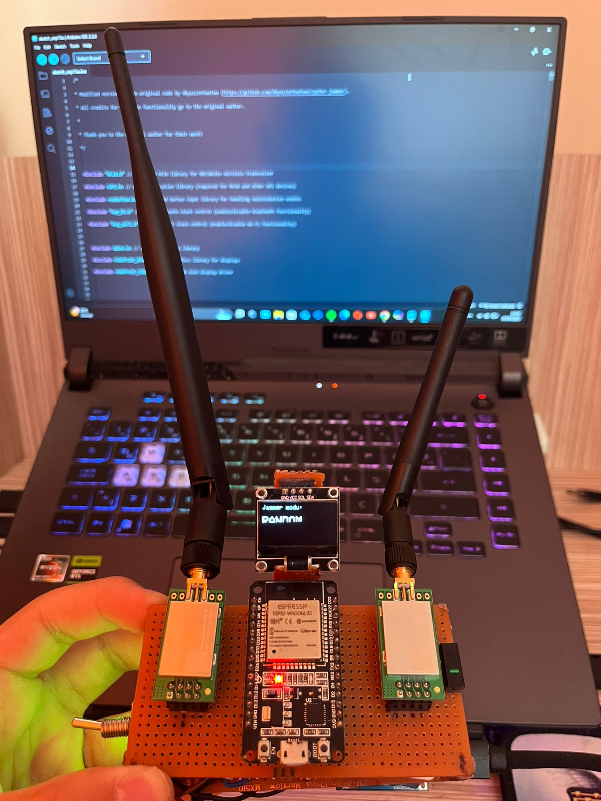

<h1 align="center">Esp32 2.4Ghz jammer</h1>

  
  <h3 align="center">!!Jammer kulanımı YASADIŞIDIR!Sadece eğitim amaçlıdır!</h3>

## ESP32-BlueJammer
Esp32 2.4Ghz Jammer parazit sinyal üreterek kablosuz cihazların sinyallerinin önüne geçer ve bağlantıyı keser 2.4Ghz bandındaki bütün kablosuz cihazlar ve ağlar bu parazit sinyalden etkilenir örneğin (bluetooth hapörlörün sesinin kesilmesi , wifi ağının bağlantısının kesilmesi , rc oyuncakların kumandasının devre dışı kalması ,Iot cihazların internete bağlanmaması,) Esp32 2.4Ghz jammer ın mesafesi donanımınıza göre değişiklik göstermektedir.

**Malzemeler:**  
- **ESP32S WiFi + Bluetooth Dual-Mode Geliştirme Kartı (30 Pin) - Gerekli pinler olduğu sürece diğer ESP32 modelleri de kullanılabilir.**
- **nRF24L01+PA+LNA (Antenli) - Mesafe performansı için antenli modül tercih edilmelidir (2 adet).**
- **10μF Kondansatör - ESP32'den 5V çıkış kullanılacağı için 5V üzeri (10V veya 16V) kondansatör uygundur (2 adet).**
- **0.96 inç I2C OLED Ekran (SSD1306)**
- **IC162 Mini Mikroswitch (3 Pin) - Jammer mod geçişi için.**
- **Toggle Switch - Açma/kapama için.**
- **TP4056 18650 Lityum Pil Şarj Modülü**
- **1S 18650 Lityum Pil Yatağı**
- **1S 18650 Pil Kapasite Göstergesi**
- **2.4GHz Anten (2 adet)** 
- **5x10 cm Delikli Pertinaks (2 adet)** 
- **Lehimleme Ekipmanları - Lehim makinesi, lehim teli, lehim pastası, tek damarlı kablo.**
- **8 Pin nRF24L01 Wireless Modül Adaptörü - İsteğe bağlı kullanılabilir. Modüllerin yanlış bağlantı veya voltajdan zarar görmemesi için adaptör kullanımı önerilir.**

---

## Antenler
nRF24L01+PA+LNA modüllerinin mesafe performansı için harici antenli versiyonlarının kullanılması şarttır. Antensiz (PCB antenli) modüllerin menzili, engelsiz ortamda dahi 10 metreyi geçmekte zorlanır ve bu modüller jammer gibi uygulamalar için kesinlikle uygun değildir.

Jammer tasarımında, parazit sinyalinin gücünü ve etkinliğini artırmak için çift anten kullanımı yaygın bir yöntemdir. İki anten kullanmak, tek antene kıyasla daha yüksek seviyede ve daha geniş bir alana parazit yayılmasını sağlar. Ayrıca, doğru uyumlu ve uygun frekansta çalışacak daha büyük bir anten kullanmak, menzili ve sinyal gücünü doğrudan artıracaktır.

---

## 3.Anten
"Bazı ESP32 modellerinde harici anten takılabilir. Yani, nRF24L01+PA+LNA antenlerinden birini, ESP32 üzerindeki dahili PCB antene takabilirsiniz. Bu da ekstra parazit sinyal üretimine ve mesafe artışına katkı sağlayacaktır

---

## Bağlantı şeması

### HSPI
| 1st nRF24L01 module Pin | HSPI Pin (ESP32) | 10uf capacitor |
|---------------|------------------|--------------------|
| VCC           | 3.3V             | (+) capacitor |
| GND           | GND              | (-) capacitor |
| CE            | GPIO 16          |
| CSN           | GPIO 15          |
| SCK           | GPIO 14          |
| MOSI          | GPIO 13          |
| MISO          | GPIO 12          |
| IRQ           |                  |

### VSPI 
| 2nd nRF24L01 module Pin | VSPI Pin (ESP32) | 10uf capacitor |
|---------------|------------------|--------------------|
| VCC           | 3.3V             | (+) capacitor |
| GND           | GND              | (-) capacitor |
| CE            | GPIO 22          |
| CSN           | GPIO 21          |
| SCK           | GPIO 18          |
| MOSI          | GPIO 23          |
| MISO          | GPIO 19          |
| IRQ           |                  |

### Status LED
| ESP32 | 4.7k Ohm Resistor | 3mm Status LED (blue)|
|-------|-------------------|----------------------|
|  GND  |                   |       (-) LED        |
|       |      Resistor     |       (+) LED        |
|GPIO27 |      Resistor     |                      |

### OLED Display I2C (additional - make sure to use the correct firmware!)
| 0.96" OLED Display I2C | ESP32 |
|------------------------|-------|
|          GND           |  GND  |
|          VCC           | 3.3V  |
|          SCL           |GPIO 5 |
|          SDA           |GPIO 4 |

### Battery modification (additional)
| 3.7V Li-Ion battery | JST-PH2 connector    | TP4056 Charging Module | Mini Slide Switch | ESP32 |
|---------------------|----------------------|------------------------|-------------------|-------|
| (+) Battery         | (+) JST-PH2          | Bat +                  |                   |       |
| (-) Battery         | (-) JST-PH2          | Bat -                  |                   |       |
|                     |                      | OUT +                  | Switch in         |       |
|                     |                      | OUT -                  |                   |  GND  |
|                     |                      |                        | Switch out        |  3V3  |

## PCB

<h3 align="center">That's how the components are placed (PCB size=7cm x 5.5cm - Larger sizes will NOT fit in the case!)</h3>

## 3D printed case
#### The 3D printed case fits ONLY a PCB size of 7cm x 5.5cm and you'll need to drill out 2 holes according for the M3 screws to fit through the PCB!
<h3 align="center">Access to the ESP32 micro-USB port, as well as to both EN & Boot buttons</h3>

<h3 align="center">TP4056 charging port access with charging state indicator holes (red=charging - blue=fully charged)</h3>

<h3 align="center">On/off switch with blue indicator LED</h3>

## V3-Case 3D model view [[download .stl](https://dwdwpld.pages.dev/V3-ESP32-BlueJammerBy@emensta3DCase.stl)]

<h3 align="center">Here's a look at the V3 2 antenna version itself</h3>

## V4-Case 3D model view [[download .stl](https://dwdwpld.pages.dev/V4-ESP32-BlueJammerBy@emensta3DCase.stl)]

<h3 align="center">Here's a look at the V4 3 antenna version itself</h3>

## About the ESP32-BlueJammer and my source code
- **Is my ESP32-BlueJammer really working?**  
  Yes! My ESP32 BlueJammer is fully functional, and no one pauses the sound in the demo video. Many people have built their own ESP32-BlueJammer and confirmed that it works! Join my Discord and see for yourself! ;D

- **Why my ESP32-BlueJammer code is NOT open source**  
  There are several "BLE Jammers" available on GitHub, but they all have limitations in frequency range, channel coverage, and effective distance (around 5 meters). Therefore I decided to develop and code my own firmware for the ESP32-BlueJammer, aiming for superior performance.

  Despite some claims that I might have copied someone else's work, it's important to clarify that extracting source code from a compiled file (.hex, .bin, etc.) is practically impossible. If I had used someone else's work, I wouldn't have been able to create custom console banners, develop multiple firmware versions, or build a web flasher. My code is entirely written from scratch. There is nothing taken from other available codes, sources, codebases or resources as a foundation, if any even exist. My code remains closed source for now, to protect the significant effort and innovation I've invested in this project.

  This isn't my last project. I'm looking forward to implementing the ESP32-BlueJammer in further ongoing projects, so for now, I'd like the code to remain closed source. Maybe someday I'll make it open source!  
  -no one knows. ;D
## Source code snippets by @emensta
- **Here are three snippets of my source code for you to compare with other available sources. This way, you can see that it was written from scratch:** 

## Discord
You can join my Discord server [here](https://discord.gg/emensta)!

## Portfolio and all my links
Here you can visit my Portfolio, you'll find everything that you're looking for [here](https://emensta.pages.dev)!

## Support me
Via [this link](https://ko-fi.com/emensta), you can leave a tip to keep me motivated developing future projects! Thank you for your support :)

<h1 align="center"> DISCLAIMER </h1>

<h4 align="center">Please note that the use of this tool is entirely at your own risk. It is intended strictly for educational purposes and should not be used for any illegal or unethical activities. Jamming is illegal and can get you in big trouble!</h4>
<h4 align="center">I'm not responsible for your actions! </h4>
